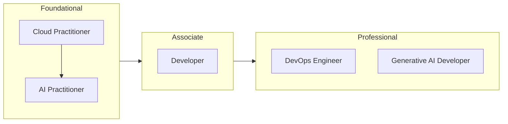
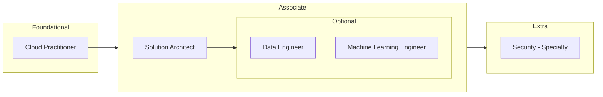
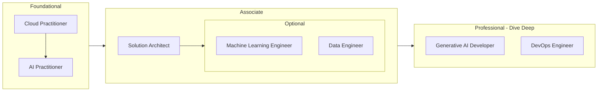
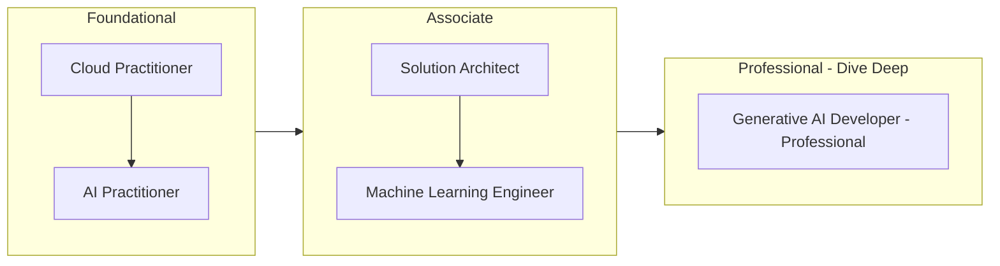

# AWS

## Certification Path

### Software Development Engineer

### Data Analytics

### Machine Learning Engineer/ML Ops Engineer

### Data scientist

## Certificates

### Foundational
- [Cloud Practitioner](./CloudPractitioner/README.md)