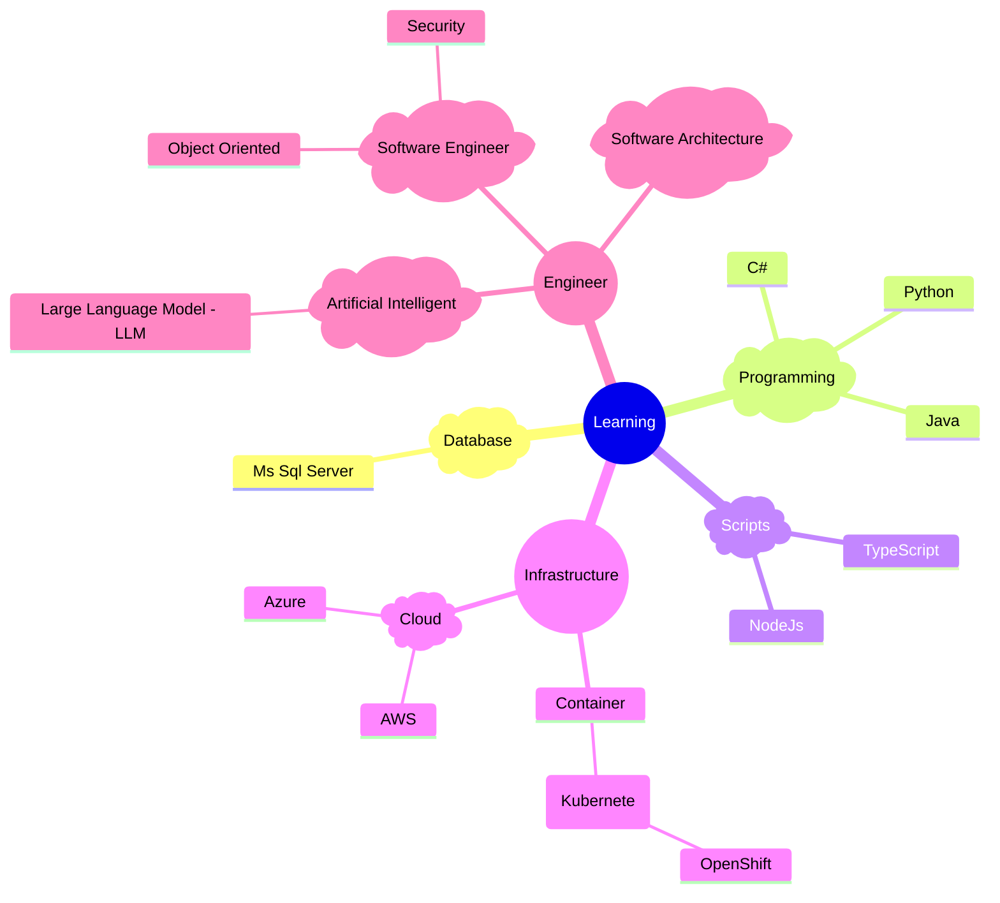

# LearningNotes

My personal learning notes

It will be divided into subsections for each main technology branches:

## Programming Languagues
  - [C#](./CSharp/README.md)
  - [Java](./Java/README.md)
    + [Spring](./Java/Spring/README.md)
  - [Python](./Python/README.md)
    + [Spark](./Python/Spark/README.md)
  - Scripts
    + [NodeJs](./Scripts/NodeJs/README.md)
    + [TypeScript](./Scripts/TypeScript/README.md)

## Database system
  - [Ms Sql Server](./SqlServer/README.md)
  
## Engineer

  - [Artificial Intelligent](./AI/README.md)
    + [LLM - Large Language Model](./AI/LLM/README.md)
  - [Software Enginner](./SoftwareEngineer/README.md)
    - [Object-Oriented](./SoftwareEngineer/ObjectOriented.md)
    - [Security](./SoftwareEngineer/Security.md)

## Infrastructure
  - [Infrastructure](./Infrastructure/README.md)
    + [Docker](./Infrastructure/Docker/README.md)

## Misc
  - [Books](./Books/README.md)
  - [Executive Briefing](./ExecBrief/README.md)

## Mindmap

### Learning tree

